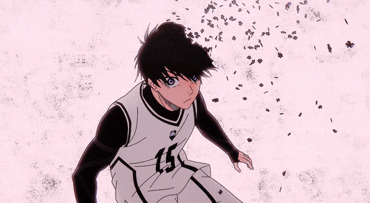

<div align="center">


### 🔵 *"A striker who isn't selfish... is worthless."*

<p align="center">
  <a href="https://ashish-patil-portfolio.vercel.app/"></a>
  <a href="https://github.com/ashp15205"></a>
  <a href="https://linkedin.com/in/ashishpatil2005"></a>
  
</p>


</div>

---

## 🥅 PLAYER PROFILE


```bash
ashish@player:~$ cat player_stats.json
```
```json
{
  "name": "Ashish Patil",
  "position": "Full-Stack AI Engineer",
  "flaw_ego_style": "Egoist Architect — builds the system, then breaks it to find the exploit",
  "current_rank": "Top Tier (self-appointed, disputed by no one)",
  "weapon": ["LangChain", "FastAPI", "React", "Raw Spite"],
  "special_move": "DIRECT SECURITY OVERRIDE — patches vulnerabilities before they're seen",
  "status": "SURVIVED THE SELECTION. STILL ON THE FIELD."
}
```

---

## ⚡ MATCH HIGHLIGHTS — GOALS SCORED


### 🥇 GOAL #1 — `Guardian-Runtime` — AI Agent Security Proxy
```diff
[GOAL SCORED] Intercepted every LLM prompt/response at the transport layer
+ 40–70% reduction in output token costs
+ 3,000+ PyPI downloads · 20⭐
+ On-device only — nothing leaves the pitch, nothing leaks
```

### 🥇 GOAL #2 — `Scankii` — AI Agent Security Scanner
```diff
[GOAL SCORED] First scanner to jointly read code + natural language for AI-native threats
+ Precision 100% · Recall 68.2% · F1 81.1%  (SkillLeakBench, ASE 2026)
+ 1,000+ PyPI downloads · no sandbox required
```

### 🥇 GOAL #3 — `CET Buddy` — College Predictor Platform
```diff
[GOAL SCORED] Parsed 220,000+ real cutoff records, fully client-side, sub-second response
+ 1,000+ users · ~80% cut in research time · $0 server cost
```

### 🥇 GOAL #4 — `KodeBattle` — Real-Time Competitive DSA Arena
```diff
[GOAL SCORED] Real-time 1v1 competitive coding platform over persistent WebSockets
+ Elo-style rating system · live analytics · 3-strike anti-cheat enforcement
```

---

## 🧠 WEAPON LOADOUT

<div align="center">

**Languages**
<br>


**AI / ML**
<br>
   

**Backend**
<br>


**Frontend**
<br>


**Databases**
<br>


**Cloud & DevOps**
<br>


</div>

---

## 📊 LIVE MATCH ANALYTICS

<div align="center">


</div>


## 🏆 SELECTION RANKING BOARD

```bash
ashish@player:~$ cat achievements.log
```
```
[MERGED]     Vibe Coding Essentials → Awesome Vibe Coding Resources (235+⭐)
[RECOGNIZED] Pulled into architecture discussions by Microsoft AutoGen community
[PUBLISHED]  Research: AI-powered certificate verification (OCR + Deep Learning + Blockchain)
[RATED]      LeetCode Contest Rating 1627 | CodeChef 3★ (1635)
```

---

<div align="center">

## 📡 TRANSFER WINDOW OPEN

```bash
ashish@player:~$ ./status --open-to
```
```
> Full-Stack Engineering
> AI / Agent Infrastructure
> Backend Systems Architecture

"The world's strongest striker isn't born.
He's the one left standing after everyone else is eliminated."
```



**Scout me. I don't miss.**


</div>
